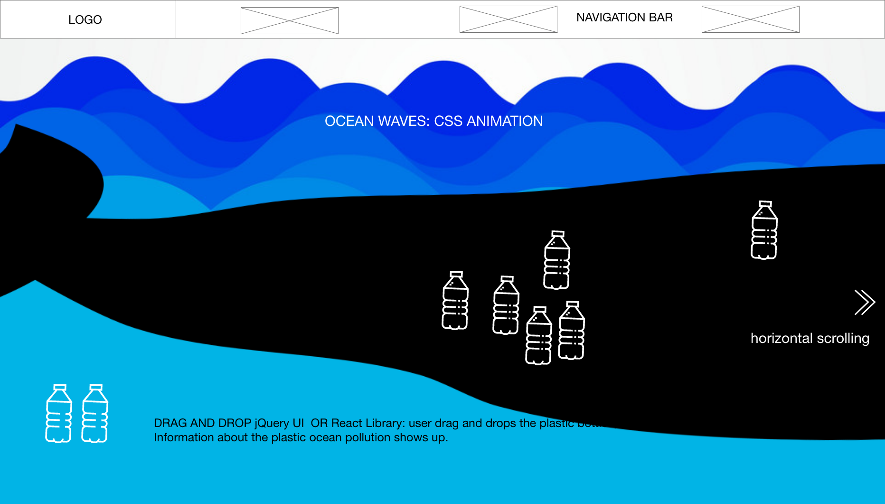
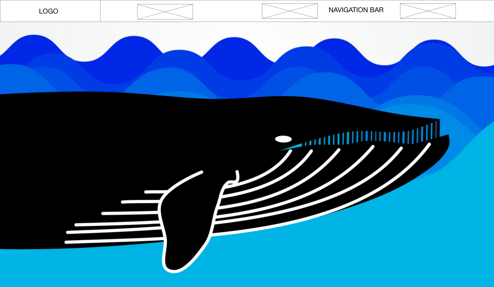
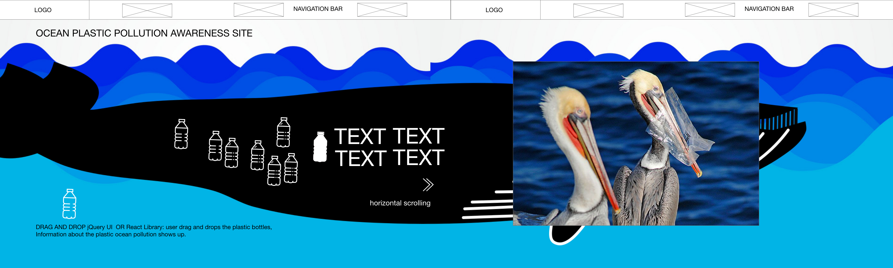
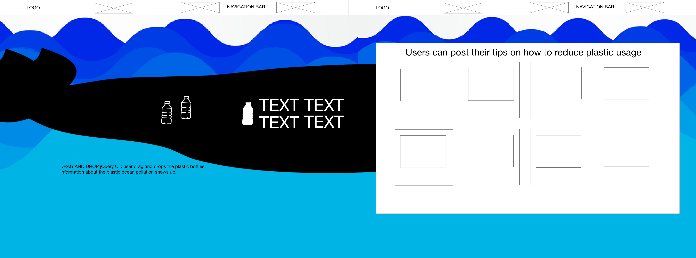

# SAVE THE OCEAN
link to live site: https://

## About
Ocean plastic pollution awareness site 
This app allows users to add and share their tips on how to reduce plastic waste.

## Tech used

* Rails
* React
* PostgreSQL

## User Stories

* Users will be able to add a post.
* Users will be able to view infomation on ocean plastic pollution.
* Users will be able to drag and drop plastic icons to view those info.
* Users will be able to edit and delete their posts.

## Wireframes

## Challenges
* 
## Future Improvements
* 
